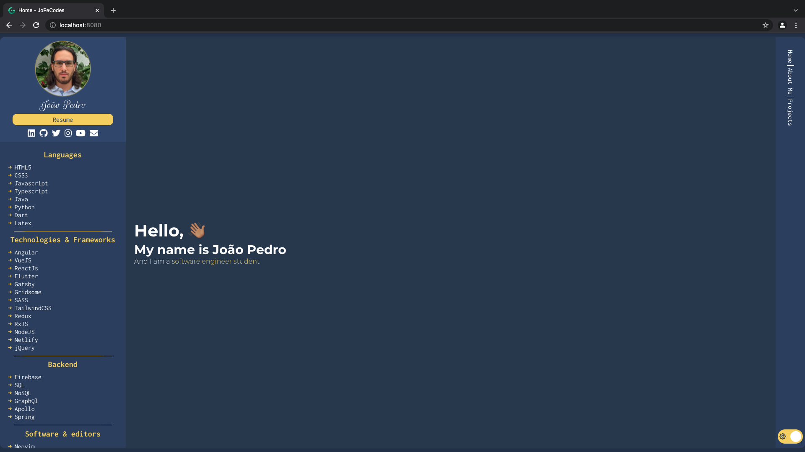

# My Typescript Portfolio

## [Check it here](https://www.jopecodes.dev/)

My Portfolio page

## Getting Started

Built with Gridsome and what an awesome framework. Also, it was built with a lot of animations so that it can be more interactive

## Specifications

I've always wanted to create an interactive website with a couple of animations. This was one experience of it.

## Built With

- Vue
- Gridsome
- SASS
- GRAPHQL
- Typescript

## Contributing

Feel free to download it and improve it. If you want just give a pull request with your changes and let me know what can be improved. Many thanks :D

## Pages

- [GitHub Page](https://github.com/BitInByte)
- [Instagram](https://www.instagram.com/bitinbyte/)
- [Twitter](https://twitter.com/BitInByte2)

## Authors

**BitInByte** - Development student and tech enthusiastic
e
